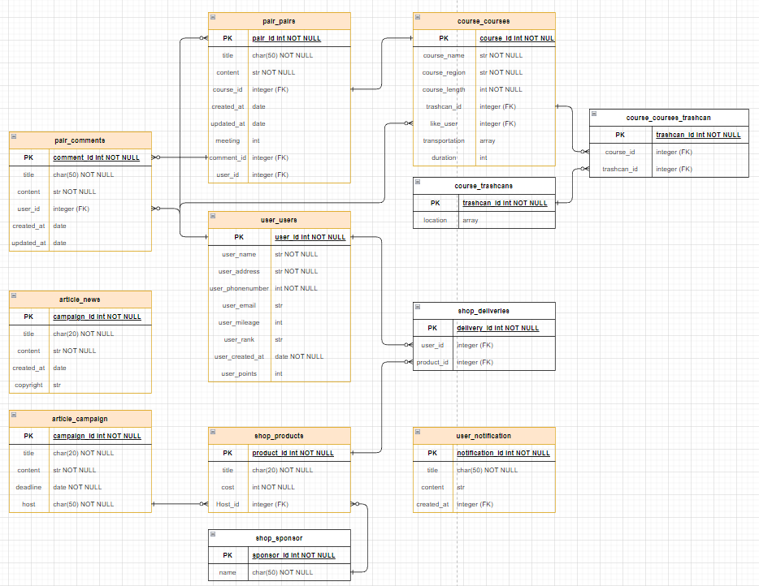

# 줍깅(Jupging)

**Team : 어째서 표고버섯**

**member : doodoo3804, Jiny8842**

### **:book: Overview of the Project**

#### Background information

플로깅이란 2016년 스웨덴에서 시작된 봉사의 일환으로 Plocka upp(이삭 줍기) + Jogging(조깅) 의 신조어

단순히 조깅이 아니라 쓰레기를 줍는 행위를 통해 런지 및 스쿼트 자세를 취하면서 조깅 그 이상의 운동효과를 볼 수 있음

우리나라에는 2018년 즈음 들어와서 2021년 MZ세대를 중심으로 SNS에서 인증을 통해 널리 확산

#### General description of the Current Project

플로깅이 우리나라에 도입되어 확산된게 오래되지 않았다. 따라서 아직 크게 활성화 되지 않은 서비스를 구현하여 지구 환경 문제가 대두되는 요즙 지구 환경보호라는 타이틀과, 개인의 건강을 동시에 챙길 수 있는 사회 전반적으로 긍적적인 효과를 기대할 수 있다. 따라서 플로깅을 시작하려는 사람이나 이미 활동을 진행중인 사람을 타겟으로 한다.

### **:bell: Goals of the Project**

#### Objectives of project

- 플로깅 활동을 원하는 유저와 같이 진행할 수 있도록 pair 기능 제공
- pair를 원하는 유저는 등록된 글에 댓글을 작성하여 pair가능
- 기본적으로 추천되는 코스(course)를 통해 쉽게 플로깅에 대해 접근 가능
- 코스 주변 쓰레기통 위치 안내
- 활동(걸음 수 / 주운 쓰레기량)을 기준으로 마일리지 적립
- 플로깅 관련 뉴스와 진행되는 캠페인에 대한 정보를 제공
- 누적된 마일리지를 통해 후원된 상품(굿즈)과 교환 가능
- 마일리지 외에 추가로 적립되는 포인트로 등급 달성 이후 추가적인 뱃지 지급
- 건강 어플 연동으로 월별 개인 목표 설정 가능

#### Overall goals of the project

플로깅이라는 활동을 개인이 또는 단체로 진행을 하고, 추가적으로 마일리지를 통해 성취감을 얻을 수 있도록 하는 플로깅을 위한 서비스 어플

### :page_with_curl: Final Product

  

**Figma 주소** : https://www.figma.com/file/HIKggAW35ePkRGtf6YDfvT/%ED%94%8C%EC%A0%9D?node-id=0%3A1

**최종 계획서(pdf)** : [어째서 표고버섯.pdf](https://github.com/DooDoo3804/Jupging/blob/master/%EC%96%B4%EC%A7%B8%EC%84%9C%20%ED%91%9C%EA%B3%A0%EB%B2%84%EC%84%AF.pdf) 

**ERD** - 

#### Current limitations

- 마일리지 적립을 위한 쓰레기통 설치
  - 플로깅 활동 이후 쓰레기를 버리기 전에 QR코드 등을 통해 활동을 인증하여 마일리지를 적립할 수 있게함
  - 쓰레기통을 자체적으로 설치하여 인증 수단을 제공함
  - 설치에 따른 비용이 발생
- 추후에 유저가 코스 등록 가능하게 함
  - 코스 등록 이후 타 유저에 의해 부적절하다고 생각되면 신고할 수 있게 함
  - 코스의 일정 범위나 거리의 일정 %가 겹친다면 등록이 불가능 하게 하여 무차별적인 등록을 막음
